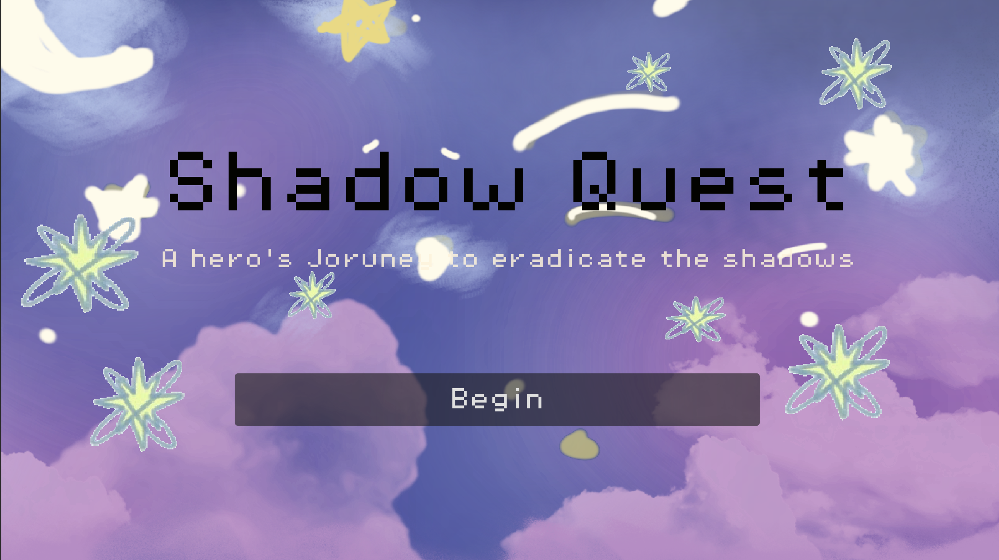
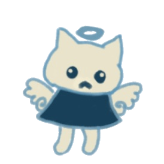
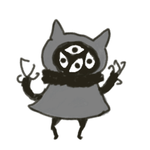
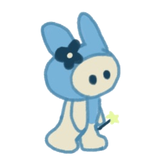
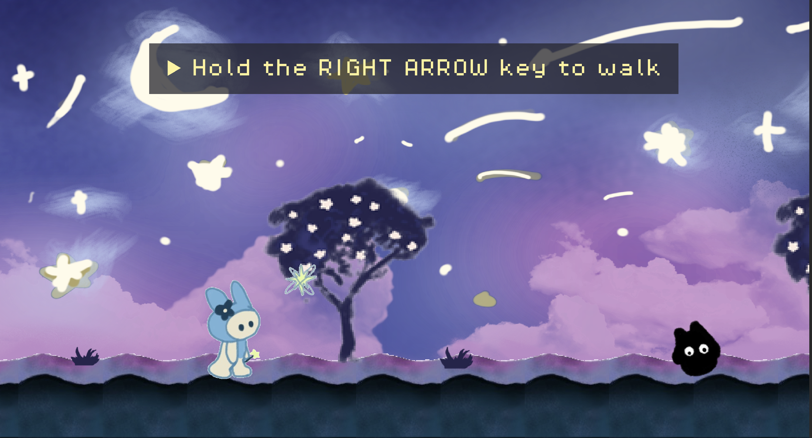
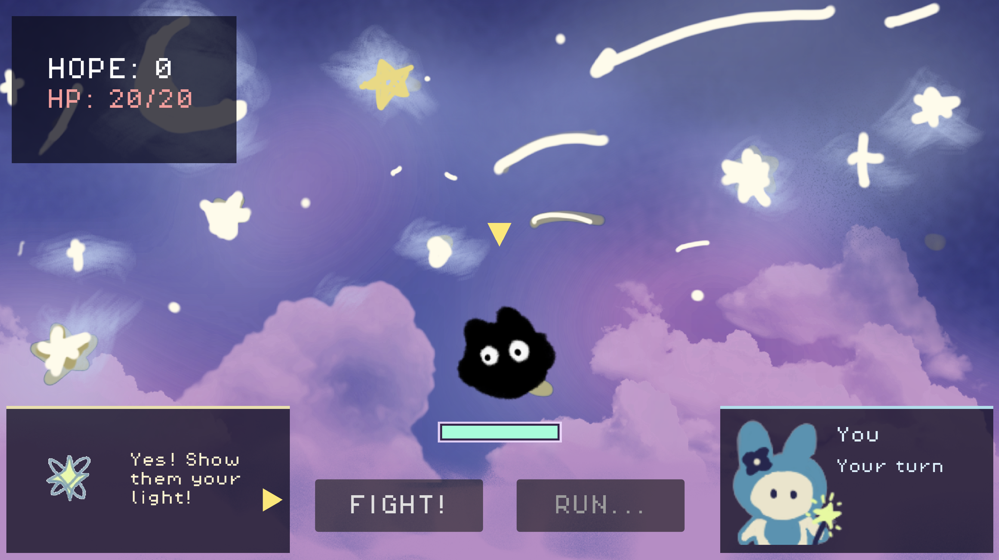

# Shadow Quest

> *"A hero's journey to eradicate the shadows."*

A short Godot game made for a Cinema Creative Project. On the surface, it looks like a soft fantasy story about a chosen hero, a magical companion, and a corrupted world that needs saving.

---

## The Setup

You play as a small, cute-looking character woken up by Pip, a tiny sparkling spirit who tells you the world is in danger and that you've been chosen to cleanse it. Pip is friendly, encouraging, and constantly reminds you that the "Shadows" are corrupt and dangerous.

The intro sets the tone exactly like the kinds of games you've seen before:

> *"Hi, I've been waiting for your appearance."*
> *"The world is in danger of corrupt individuals."*
> *"Hold the right arrow key to walk and purify enemies!"*

That is the story the game hands you.

The rest of the game is about whether you believe it.

You walk to the right through a soft pastel world filled with clouds, trees, and glowing colors. Ahead of you are small dark figures called the Shadows.

---

## Gameplay

The game is structured around four encounters:

**1 shadow → 2 shadows → 4 shadows → 1 boss**

Combat is a small turn-based RPG battle screen inspired by classic menu-based games.

Each round goes like this:

1. **Pip's turn**

   * *Cheer* buffs your next attack
   * *Heal* restores HP

2. **Your turn**

   * *Fight* or *Run*
   * If you fight, you choose between:

     * *Shine*
     * *Purify*

Pip tells you which spell to use. Using the "wrong" one makes Pip irritated, then angry.

3. **Enemy turn**

   * The shadows attack back.
   * Weakly.

Every enemy you kill gives you **+1 HOPE**.

After each fight, the game pauses and asks:

> *"...will you look at what's left of them?"*

You can choose:

* **Observe**
* **Walk away**

Observing reveals what was actually there. Walking away lets you keep moving without seeing it.

---

## What the Story Is Actually About

The shadows die very easily. A little too easily.

And every time one falls, the game lets something slip through Pip's narration:

> *"...mother..."*
> *"...we were just—"*
> *"...is anyone going to remember—"*

If you choose to Observe after battle, things become clearer:

> *"A small wooden charm rests in the dirt. A child's name, carved badly."*
> *"Two of them fell holding each other. You hadn't noticed before."*
> *"They look pitiful, malnourished. You doubt they are of any harm."*

Pip immediately interrupts and pushes you forward:

> *"Don't. Don't look so long, hero. They were Shadows."*

The boss fight makes everything explicit.

The "vast Shadow" flickers between forms while speaking:

> *"...please... I haven't seen my—"*
> *"...my name was—"*
> *"...we were just running..."*
> *"...the light... the light hurts..."*
> *"...you don't have to do this..."*

And Pip responds:

> *"That's not real. I'M real. Hit it!"*
> *"It will say ANYTHING to stop you. END IT!"*

If you defeat the boss, a folded letter falls into the dust. Pip asks you not to read it.

If you do, it says:

> *"All we wanted was to have a better life here. It was for a better life for me and my children, but they slowly turned against us, blaming us for famine and disease. We had no option to run, hide, and fight."*

The monsters were never monsters.

---

## The Allegory

Underneath the fantasy setup, the game is also an allegory about scapegoating.

More specifically, it is about the way famine, disease, and hardship are often blamed on outsiders, refugees, or vulnerable groups, and how propaganda convinces ordinary people to participate in violence against them.

The boss letter reveals the truth:

> *"They slowly turned against us, blaming us for famine and disease."*

The "Shadows" are not monsters. They are people who were displaced, starving, and hunted after being labeled dangerous.

Pip is intentionally designed to be the least suspicious figure in the game.

Bright. Cute. Sparkling. The "light."

The thing calling itself the light is also the thing telling you not to look too closely.

---

## Endings
- Pacifist
- Boss Only
- Walk Away With Regret
- Massacre

---

## Why I Made This

In class, we were talking about parables and allegories, and we had an exercise where we wrote a shrot one in class. One of the mediums was through games which I thought was a underused platform to communicate this type of story. I wanted to make a game where it subverts your expectations and makes the player slowly feel more uncomfortable with the situation. 

It was inspired by games like Omori and Undertale, along with the kind of tonal shifts you get in Black Mirror episodes.

I actually do not play many games myself. I mostly watch streams and video essays, which honestly might be why it was easier for me to notice the structure behind these kinds of mechanics.

The project itself is short and simple, but I wanted the mechanics and the message to be pretty clear.

